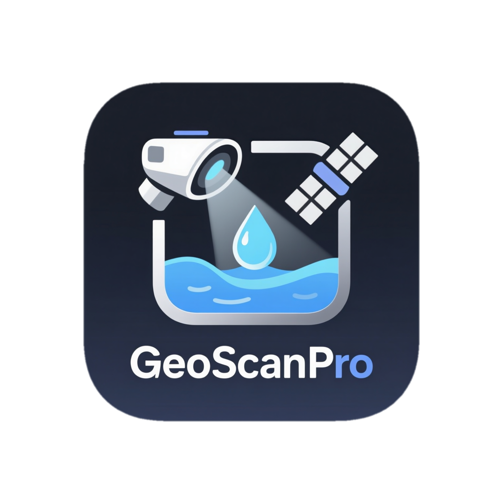

<p align="center">
  
</p>

<h1 align="center">GeoScanPro</h1>

<p align="center">
  
  
  
  
</p>

Десктопное приложение для автоматического детектирования водных объектов на снимках Landsat 9.

---

## Как это работает

1. **Загрузка** — импорт файлов Landsat 9 Level-2 Collection 2 `.tif` (каналы SR\_B2–SR\_B7 + QA\_PIXEL; опционально ST\_B10, ST\_CDIST)
2. **Предобработка** — масштабирование отражательной способности (×0.0000275 − 0.2), построение масок облаков, теней, снега и цирусов из битовых флагов QA\_PIXEL
3. **Вычисление индексов** — расчёт пяти спектральных водных индексов: NDWI, MNDWI, AWEI\_nsh, LSWI, WI
4. **Ансамблевое голосование** — каждый индекс голосует; пиксели с ≥3 голосами классифицируются как вода; облачные пиксели исключаются на этом этапе
5. **Морфологическая обработка** — closing/opening 3×3 для устранения шума; удаление объектов ниже минимального размера
6. **Заполнение под облаками** — итеративное восстановление водных пикселей, скрытых облаками, по анализу окружения компонента
7. **Анализ** — детектирование контуров по каждому водному объекту: площадь (км²), периметр, коэффициент формы, количество объектов
8. **Визуализация** — истинноцветной RGB с гамма-коррекцией, оверлей воды, отрисовка контуров, карта облачности с боксами заполнения
9. **Экспорт** — результаты сохраняются в историю SQLite, доступен экспорт в CSV/Excel

---

## Настройки детектирования

### Пороги индексов

| Параметр | Диапазон | По умолчанию | Описание |
|---|---|---|---|
| NDWI | −1.0 … 1.0 | 0.30 | Нормированный водный индекс (Green/NIR). Основной детектор открытой воды. Повысьте при ложных срабатываниях на влажной почве, понизьте если теряются мелкие водоёмы. |
| MNDWI | −1.0 … 1.0 | 0.20 | Модифицированный NDWI (Green/SWIR1). Лучше работает в городских зонах и при мутной воде. |
| AWEI | −10 … 10 | 0.00 | Индекс без теневой коррекции. Подавляет ложные срабатывания в тёмных незастроенных областях. |
| LSWI | −1.0 … 1.0 | 0.30 | NIR/SWIR1. Чувствителен к влажности почвы и прибрежным зонам. Понизьте осторожно — даёт ложные срабатывания на влажной растительности. |

Пиксель считается водой если **≥3 индекса из 5** превышают свой порог.

---

### Детектирование

**Маскировать тени облаков** — исключает пиксели теней (QA бит 4) из детектирования. Держите включённым в большинстве случаев: тени от облаков на горах и суше иначе ошибочно классифицируются как вода. Отключайте только если облачные тени падают непосредственно на водоём и создают в нём дыры — в таком случае дополнительно включите «Заполнить под облаками».

**Морфологическая обработка** — closing 3×3, затем opening 3×3 после голосования. Устраняет одиночные шумовые пиксели и сглаживает края водных объектов. Рекомендуется держать включённым.

**Мин. объект, пикс.** — объекты меньше этого порога удаляются после всей обработки (включая заполнение). При разрешении 30 м/пикс: 100 пикс ≈ 0.09 км². Увеличьте при сильном шуме, уменьшите если теряются небольшие озёра.

**Слияние разрывов, пикс.** — closing с увеличенным ядром для объединения близко расположенных водных объектов. 0 = выключено. Полезно для рек с пропусками или фрагментированных водоёмов.

---

### Заполнение под облаками

Восстанавливает водные пиксели, скрытые облаками и тенями, методом анализа окружения облачного компонента. На виде «Облака» зелёный бокс означает компонент, который будет заполнен; синий — не пройдёт порог.

**Заполнить под облаками** — основной переключатель. Итеративно (до 8 проходов) заполняет облачные области, если их периметр достаточно окружён водой.

**Мин. площадь, пикс.** — компоненты меньше этого значения игнорируются. Значение 20 пикс подходит для большинства случаев. Уменьшите до 5–10 если не заполняются небольшие теневые области над водой.

**Мин. окружение водой** — доля периметра облачного компонента, которую должна составлять вода, чтобы компонент был заполнен. 0.50 = 50%. Понизьте (до 0.30–0.40) если облако частично выходит за берег или плохо заполняются краевые компоненты. Повысьте (до 0.60–0.70) если заполняются облака над сушей.

---

### Дополнительные маски

**Буфер QA, пикс.** — расширяет QA-маску облаков на N пикселей перед детектированием. Захватывает «чёрную мешанину» на краях облаков (cloud adjacency effect) — пиксели с испорченной яркостью, которые QA не пометила. Расширенные пиксели восстанавливаются через «Заполнить под облаками». Начните с 2–4 пикс; при наличии ST\_CDIST предпочтительнее буфер облаков.

**HOT-маска** — Haze Optimized Transform: `HOT = Blue − 0.5 × Red`. Высокий HOT указывает на дымку или полупрозрачные облака, не отмеченные QA. Не требует дополнительных файлов. Порог 0.05 — мягко (только явная дымка), 0.03 — агрессивнее. Не использовать при низкой освещённости или над тёмной растительностью — возможны ложные маскирования.

**Темп. маска (ST\_B10)** — требует файл `ST_B10.TIF`. Маскирует пиксели холоднее заданного порога (°C) с высокой яркостью в зелёном канале — незамаскированные QA облака и цирусы. Полезно при высоком содержании цирусов. Не включать если в сцене есть очень холодная открытая вода (0–2 °C).

**Буфер облаков (ST\_CDIST)** — требует файл `ST_CDIST.TIF`. Маскирует переходную зону в радиусе N км от границы облака. Работает точнее буфера QA, так как основан на реальном расстоянии до ближайшего облака. При наличии файла предпочтительнее «Буфера QA».

---

## Установка

```bash
pip install -r requirements.txt
python main.py
```

## Зависимости

| Пакет | Версия |
|---|---|
| PySide6 | ≥ 6.6.0 |
| numpy | ≥ 1.24.0 |
| opencv-python | ≥ 4.8.0 |
| rasterio | ≥ 1.3.0 |
| scipy | ≥ 1.11.0 |
| scikit-image | ≥ 0.21.0 |
| matplotlib | ≥ 3.7.0 |
| pandas | ≥ 2.0.0 |
